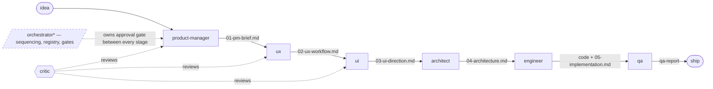

# Agent-C — Architecture & Skills Overview

> A distributable, multi-agent software-development system for solo devs and indie
> hackers: take an idea from concept to shipped without holding the whole process
> in your head. Each stage produces a **reviewable artifact** you approve before
> advancing — a transparent, steerable pipeline rather than a black box.

This document is the top-level map: the design principles, the skills and how they
relate, the lifecycle and its artifacts, and how to extend the system. For the
mechanics of one cross-cutting pattern, see
[docs/DUAL-MODE-SKILL-PATTERN.md](docs/DUAL-MODE-SKILL-PATTERN.md).

---

## 1. Core design principles

These are locked decisions that every part of the system honors.

- **Skill-first.** Each role is a **SKILL** (a `SKILL.md` with frontmatter + a
  method), not a bespoke agent. "Agents" are thin wrappers that call the same
  skill, so manual use (e.g. Claude Desktop) and orchestrated use never drift.
- **Canonical in the repo, live via symlink.** The source of truth for each skill
  is `agents/<name>/SKILL.md`. Each is **symlinked** into `~/.claude/skills/`, so
  edits in the repo are immediately live everywhere — independent of any session.
- **Artifacts are the interface.** Stages hand off through **versioned Markdown
  docs** in a project's `docs/product/` (`01-pm-brief.md` → `02-ux-workflow.md` →
  `03-ui-direction.md` → `04-architecture.md` → …). A stage reads the prior
  artifact and writes the next.
- **Dual-mode by default.** Every role skill works both inside the full workflow
  (reads its upstream artifact) and as a standalone jump-in on an existing project
  (reverse-engineers what it needs). See §5.
- **Analysis before proposing.** Each role first analyzes (from artifacts or by
  reverse-engineering), reports its understanding, and gets the user's confirmation
  *before* doing its real work.
- **Recommend, don't auto-chain.** A stage returns control when done and
  *recommends* the next stage. Sequencing, the project registry, and approval gates
  belong to the **orchestrator** (the human, in manual use). No stage invokes the
  next directly.
- **Product-type aware.** Skills never assume a GUI. Each adapts its vocabulary and
  outputs to the product type (GUI app / CLI / agentic / API). The type is set in
  the PM brief and flows downstream.
- **Multi-project.** Each project lives at its own configurable path. Every skill
  establishes the active project/path *first*. A central registry/dashboard
  (orchestrator-owned) tracks each project's location and current stage.

---

## 2. Skill catalog

Three kinds of skill live in `agents/`:

| Skill | Kind | Purpose | Reads → Writes |
|---|---|---|---|
| [`elicitation`](agents/elicitation/SKILL.md) | Shared method | The discipline of eliciting well — one question at a time, probe the four corners, reflect back, know when to stop. | invoked by every role |
| [`best-practices`](agents/best-practices/SKILL.md) | Shared method | Choose current, proven best practice over the most-frequently-seen pattern; guards against frequency bias *and* its opposite (novelty-chasing). "Best practice is craft, not sameness." | invoked by every role |
| [`feature-mode`](agents/feature-mode/SKILL.md) | Shared method | **Mode C** — jump into an existing codebase to build *one feature*: profile the project once, scope artifacts under `docs/features/<slug>/`, right-size the pipeline, and **conform** to existing conventions. | invoked by any role doing feature work |
| [`product-manager`](agents/product-manager/SKILL.md) | Role (stage 1) | Define the **what & why** — problem, users/JTBD, value, scope, metrics. | (seed) → `01-pm-brief.md` |
| [`ux`](agents/ux/SKILL.md) | Role (stage 2) | Define **how it works** — flows, IA, screens-as-structure, states. Optional low-fi wireframes. | `01` → `02-ux-workflow.md` |
| [`ui`](agents/ui/SKILL.md) | Role (stage 3) | Define **look, feel, taste & voice**. Carries the taste; guards against AI slop. Optional mockups. | `01`/`02` → `03-ui-direction.md` |
| [`architect`](agents/architect/SKILL.md) | Role (stage 4) | Define the **technical architecture** — structure, runtime, data, decisions. Optional diagrams. | `01`/`02`/`03` → `04-architecture.md` |
| [`engineer`](agents/engineer/SKILL.md) | Role (stage 5) | **Implement** in working, tested code — greenfield, existing-codebase, or feature. Conforms to conventions; verifies; never auto-deploys. | `01`–`04` → code + `05-implementation.md` |
| [`qa`](agents/qa/SKILL.md) | Role (stage 6) | **Verify** the implementation against the artifacts — acceptance criteria, flows/states/edge cases, build/tests, conformance, a11y, regressions. Reports a verdict; doesn't block. | `01`–`05` + code → `qa-report` |
| [`critic`](agents/critic/SKILL.md) | Quality | Review PM/UX/UI artifacts across 8 criteria, max two passes; reports to the human gate (does not block). | any artifact → `critic-reports/` |

**Not yet built:** the **orchestrator** (owns the registry + approval gates). See §8.

> **`qa` vs. `critic`:** the critic reviews *upstream artifacts* (PM/UX/UI docs)
> before they're approved; QA verifies the *implementation* against those artifacts
> after the engineer builds.

---

## 3. The lifecycle & artifact chain



`* = not yet built.` Each arrow is an **approval gate**: the human (or orchestrator)
reviews the artifact and decides whether to proceed, revise, pause, or switch
projects. Deferred items accumulate in `docs/product/backlog.md` at every stage.

The same roles also run in **Mode C (feature jump-in)** against an existing product
via the `feature-mode` skill — the pipeline is right-sized and artifacts are scoped
under `docs/features/<slug>/` (see §5).

Side artifacts a stage may produce: `wireframes/` (UX, low-fi), `mockups/` (UI,
shows the aesthetic), `diagrams/` (architect, Mermaid).

---

## 4. Anatomy of a role skill

Every role skill shares the same skeleton, so they're predictable to use and to
extend:

1. **Frontmatter** — `name`, and a `description` with trigger phrases and a note
   that it's dual-mode.
2. **Method** — two phases: **Analysis** (Mode A reads artifacts / Mode B
   reverse-engineers, then reports and confirms) → **Elicitation** (via the shared
   `elicitation` skill). Plus a "throughout" pointer to `best-practices`.
3. **Operating modes + elicitation fallback** — how to detect Mode A/B/C and what to
   ask when upstream artifacts are missing (Mode C defers to `feature-mode`).
4. **Product-type step** — adapt vocabulary/outputs to GUI / CLI / agentic / API.
5. **Themes** — the role's question bank, worked one at a time.
6. **Optional visual artifact** — wireframes / mockups / diagrams, offered not
   forced.
7. **Output** — fill the role's template, write the numbered artifact, append
   deferred items to `backlog.md`, recommend the next stage.
8. **Handoff contract** — return control; never auto-chain.
9. **Customizing this skill** — what's safe to rewrite vs. the contract to preserve.

---

## 5. Operating modes

Each role can run in one of three modes:

- **Mode A — full workflow:** the upstream doc exists (e.g. UI finds
  `02-ux-workflow.md`). Read it; proceed as designed.
- **Mode B — standalone jump-in:** the upstream doc is missing. Ask the user for
  context and **reverse-engineer** the existing product to produce the same
  first-class *whole-product* artifact (documenting what exists).
- **Mode C — feature jump-in:** design/build **one feature inside an existing
  product**. The product is context and constraint; the deliverable is a
  *feature-scoped* artifact (or code) that **conforms** as if it had always been
  there. Driven by the shared [`feature-mode`](agents/feature-mode/SKILL.md) skill:
  profile the project once into `docs/project-profile.md`, scope artifacts under
  `docs/features/<slug>/`, right-size which stages run, and conform rather than
  reinvent (the *Taste & originality* test inverts to "does this look like it was
  always part of *this* product?").

Modes A/B mechanics and the adaptation template are in
[docs/DUAL-MODE-SKILL-PATTERN.md](docs/DUAL-MODE-SKILL-PATTERN.md); Mode C is fully
specified in the `feature-mode` skill.

---

## 6. Cross-cutting disciplines

Beyond the two shared method skills, these patterns run through every role:

- **Elicitation discipline** — never a wall of questions; one at a time, prefer
  multiple choice, reflect back, stop when returns diminish.
- **Best-practices / anti-frequency-bias** — anchor each significant choice on the
  current, proven option and justify it against the project's drivers, not on how
  often the pattern appears. Don't over-correct into novelty. Flag staleness against
  the knowledge cutoff. (The architect specializes this into its **Decision
  quality** section — e.g. a typed ORM over hand-rolled raw SQL unless raw SQL is a
  justified fit.)
- **Taste & anti-slop (UI)** — best practice governs *craft*; **taste is the point
  of view** that craft expresses. The UI skill carries the taste (rather than
  offloading design decisions onto a user who may have none), leads with a design
  concept, avoids the generic defaults by name, and passes the "only this product"
  distinctiveness test.
- **Conform-don't-reinvent (feature mode)** — when working on a feature inside an
  existing product, "best practice" and "taste" invert toward **fitting the existing
  conventions**; new patterns are the justified exception, not the default. Carried
  by the `feature-mode` skill.
- **Backlog as a first-class artifact** — anything deferred is appended to
  `docs/product/backlog.md` so it isn't lost in a single doc's open questions.
- **Establish the active project first** — supports concurrent multi-project work.

---

## 7. How skills are installed

Skills are authored in this repo and surfaced to the Claude runtime by symlink:

```bash
ln -s "$(pwd)/agents/<name>" ~/.claude/skills/<name>
```

The canonical file is `agents/<name>/SKILL.md`; the symlink makes it live in the
user's skill directory. Editing the repo file edits the live skill. Current links:
`elicitation`, `best-practices`, `feature-mode`, `product-manager`, `ux`, `ui`,
`architect`, `engineer`, `qa`, `critic`.

---

## 8. Build status

**Built:** `elicitation`, `best-practices`, `feature-mode`, `product-manager`, `ux`,
`ui`, `architect`, `engineer`, `qa`, `critic` — all symlinked, with the
operating-modes + analysis + handoff contract + customizing structure. **All six
lifecycle roles (PM → UX → UI → architect → engineer → QA) now exist**, completing
the thin slice through the whole lifecycle.

**Approach to v1:** a thin slice through the *whole* lifecycle (all roles shallow)
before deepening any one.

**Not yet built:**
- The **orchestrator** — owns the project registry, stage sequencing, and approval
  gates. It consumes the UX workflow's touchpoints/states and the architect's
  registry/state design as *requirements*. Until it exists, the **human is the
  orchestrator** in manual use.
- Thin **agent wrappers** in `agent-defs/` (currently empty).

Agent-C has been run on itself: `docs/product/` holds `01-pm-brief.md`,
`02-ux-workflow.md`, `backlog.md`, `wireframes/`, and `critic-reports/`.

---

## 9. Extending the system

To add a new role skill, follow the existing roles as templates and preserve the
contract:

1. Create `agents/<name>/SKILL.md` with the skeleton from §4.
2. Make it **dual-mode**: check for the upstream artifact; reverse-engineer in its
   absence.
3. Invoke the shared **`elicitation`** and **`best-practices`** skills; add a
   one-line domain specialization of best practice.
4. Keep **product-type awareness**, the **backlog** step, and "establish the active
   project first."
5. Write a numbered artifact and a **handoff contract** that returns control and
   recommends the next stage — never auto-chains.
6. Add a **Customizing this skill** section (what's safe to change vs. the contract
   to preserve).
7. Symlink it into `~/.claude/skills/` (§7).

---

## 10. Repository layout

```
Agent-C/
├── ARCHITECTURE.md            # this file
├── agents/                    # canonical skills (symlinked into ~/.claude/skills/)
│   ├── elicitation/           # shared method: how to elicit
│   ├── best-practices/        # shared method: choose current best practice
│   ├── feature-mode/          # shared method: Mode C — feature jump-in
│   ├── product-manager/       # stage 1 — what & why → 01-pm-brief.md
│   ├── ux/                    # stage 2 — how it works → 02-ux-workflow.md
│   ├── ui/                    # stage 3 — look & feel → 03-ui-direction.md
│   ├── architect/             # stage 4 — architecture → 04-architecture.md
│   ├── engineer/              # stage 5 — implementation → code + 05-implementation.md
│   ├── qa/                    # stage 6 — verification → qa-report
│   └── critic/                # quality review of PM/UX/UI artifacts
├── agent-defs/                # (reserved) thin agent wrappers
└── docs/
    ├── DUAL-MODE-SKILL-PATTERN.md
    └── product/               # Agent-C's own lifecycle artifacts (whole-product)
        ├── 01-pm-brief.md
        ├── 02-ux-workflow.md
        ├── backlog.md
        ├── wireframes/
        └── critic-reports/

# In a target project, feature work (Mode C) adds:
#   <project>/docs/project-profile.md          # reverse-engineered conventions
#   <project>/docs/features/<slug>/01-feature-brief.md … 05-implementation.md
```
