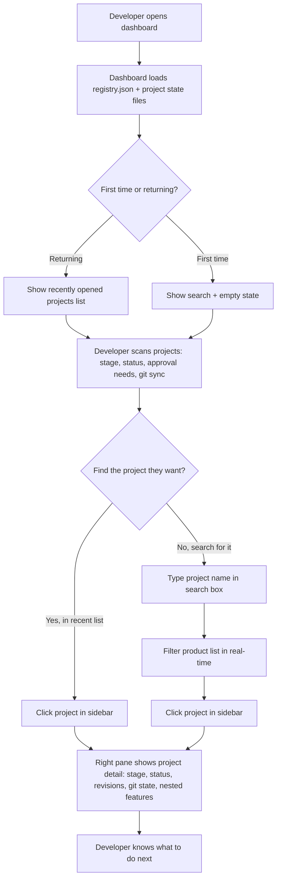
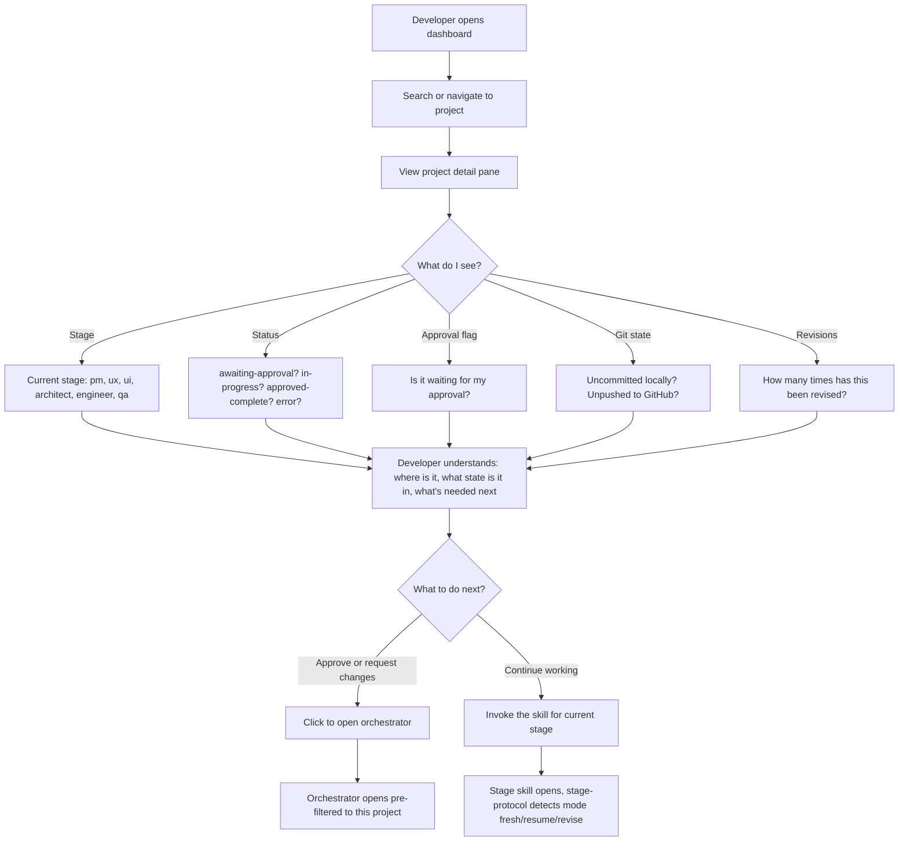
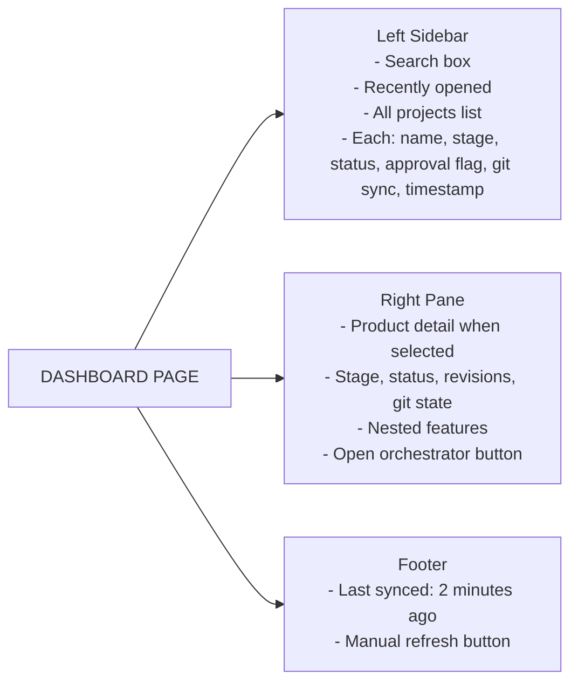
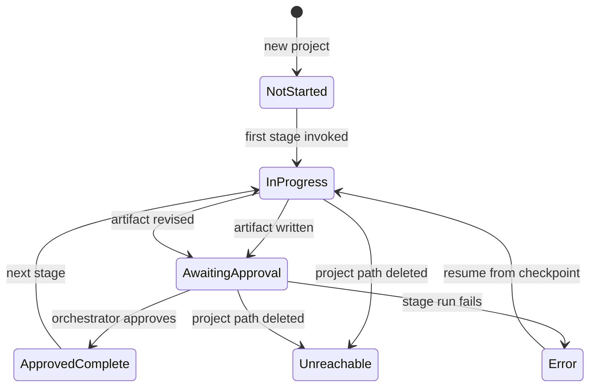
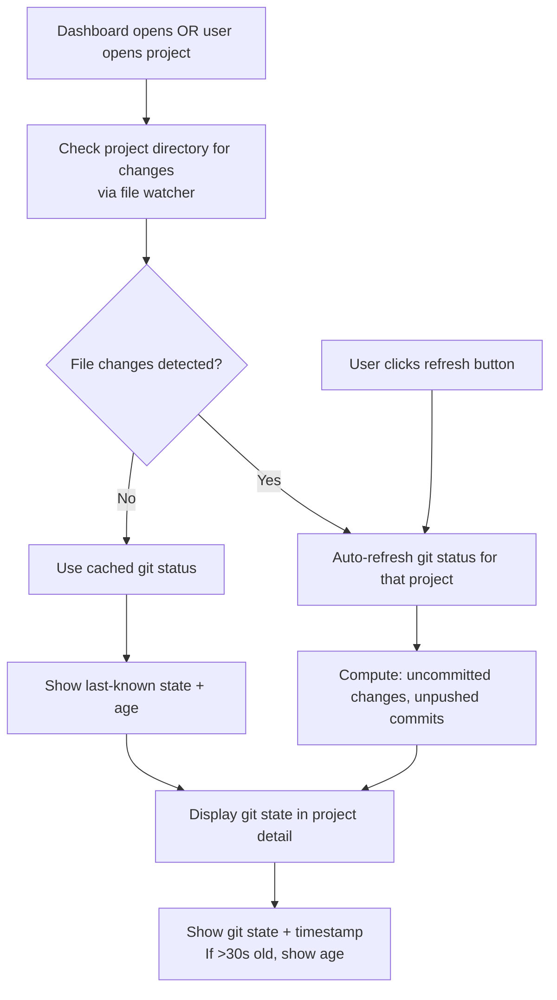
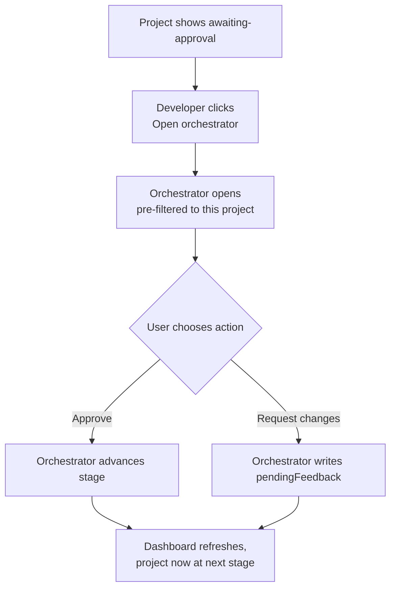

# UX Workflow — Agent-C Dashboard

> How the product works (flows & structure, not visual style). Written by the UX agent
> from 01-pm-brief.md. Read by UI next (03-ui-direction.md). Date: 2026-06-27

**Product type:** Web app (single-page, local-first, offline-capable)

## 1. Primary user flows

### Flow A: Solo — "See all my projects at a glance"

### Flow B: Handoff — "Pick up a project and understand its state"

---

## 2. Entry points & information architecture

**Entry point:** Browser (local file serving or Electron app)

**Top-level structure: Sidebar + Right pane**

- **Left sidebar:** Product list (searchable, scrollable)
  - Search box at top (filters products in real-time)
  - Recently opened products (5-10 most recent, pinned at top)
  - All products below (sorted by last updated, descending)
  - Each product shows: name, stage, status, approval flag, git sync, timestamp

- **Right pane:** Product detail (when product is selected)
  - Product name + path
  - Current stage (prominent)
  - Status (with explanation of what's needed)
  - Revision count for current stage
  - Git state details (uncommitted changes, unpushed commits, last refresh time)
  - Nested features list (if any Mode C features exist)
    - Each feature: name, stage, status, revisions, git state (same as product)

**Navigation:**
- Click product in sidebar → load product detail in right pane
- Click feature in detail → load feature detail in right pane
- Back button or breadcrumb to return to product list
- Search filters sidebar in real-time
- Manual "refresh" button to force git state recompute

---

## 3. Key screens/views & purpose

### View 1: Dashboard home (products list + empty right pane)

**Purpose:** Developer sees all their projects at a glance, can search and pick one.

**Content:**
- Sidebar:
  - Search box (clear, placeholder "Search projects...")
  - "Recently opened" section (5-10 projects)
    - Each: name, stage badge, status badge, approval flag, git sync icon, timestamp
  - "All products" section (sorted by last updated)
    - Same columns as recent
- Right pane: Empty state or welcome message ("Select a project from the sidebar to view details")

### View 2: Product detail

**Purpose:** Developer sees everything about a project — where it is, what needs attention, what's uncommitted, whether to take action.

**Content:**
- Header:
  - Product name + path (copyable)
- Main section:
  - Current stage (large, prominent, e.g., "Stage: UX")
  - Status explanation (e.g., "Awaiting approval" in red, "Click to open orchestrator")
  - Revision count ("Revisions: 2")
- Git state section:
  - Last synced timestamp ("git status from 2 minutes ago")
  - Uncommitted changes count ("3 uncommitted changes")
  - Unpushed commits count ("2 commits not pushed to GitHub")
  - Manual refresh button
- Features section (if Mode C features exist):
  - List of nested features
  - Each feature: name (clickable), stage, status, revision count, git state (summary)
- Action button:
  - "Claude Prompt" (copies a context-aware prompt to the clipboard; paste into Claude Desktop to continue)

### View 3: Feature detail

**Purpose:** Same as product detail, but for a single Mode C feature.

**Content:**
- Header: Feature name, parent product name, feature slug
- Same sections as product detail (stage, status, git state, revisions)
- Back button or breadcrumb to return to product detail

---

## 4. States & feedback

### Loading states

- **Dashboard opening:** "⏳ Loading projects..." (brief spinner, <2 seconds usually)
- **Product selected, git status computing:** "⏳ Computing git status..." (for that project only)

### Sync states

- **In sync:** No banner; silently working
- **Syncing:** "⏳ Syncing with registry..." (appears briefly if files changed)
- **Out of sync, auto-recovering:** "⏳ Detected changes, refreshing..." (file watcher triggered)
- **Last synced timestamp:** Always shown in footer or project detail ("Last synced 2 minutes ago")

### Git state states

- **Fresh (just computed):** "✓ git status current"
- **Cached (>30s old):** "git status is 2 minutes old (click refresh)" — shown in project detail
- **Computing:** "⏳ Computing git status..."
- **Failed:** "✗ Git status unavailable (check project path or git config)"

### Approval states

- **Awaiting approval:** "⚠ Approval needed" (highlighted in red/orange, with "Open orchestrator" button)
- **Approved:** "✓ Approved, ready for next stage"
- **In progress, no approval needed yet:** "In progress"

### Error states

- **Project unreachable (path missing):** "✗ Project path not found: /Users/me/old-path"
  - Show repoint instructions or link to orchestrator
- **Corrupt state.json:** "⚠ Project data is incomplete (some fields missing)"
  - Show what's missing, advise to rerun orchestrator or check the file
- **Git status failed:** "✗ Git status unavailable (file may be corrupted or git not installed)"
  - Show last-known state if available
- **Registry.json missing:** "✗ Registry not found — run orchestrator first to initialize"

---

## 5. Edge cases & off-happy-path

### Project path moved or deleted

- Project shows in sidebar with `status = "unreachable"`
- Right pane: "✗ Project path not found"
- Advice: "This project was moved or deleted. Use the orchestrator to repoint or remove it."
- User can click to open orchestrator or manually fix the path

### Git status computation fails

- Show last-known git state (cached) with timestamp (e.g., "git status from 5 minutes ago")
- Add warning: "⚠ Could not compute current git status; showing cached data"
- Manual refresh button available to retry

### Registry/state files manually edited (corrupt JSON)

- Dashboard validates JSON on load
- If corrupt, load what it can and mark the problem area
- Show warning: "⚠ Project data is incomplete (some fields missing or invalid)"
- Explain which fields are affected
- Advise to manually fix or rerun orchestrator

### Developer works on project while dashboard is open

- **Smart file watching:** Dashboard watches project directories
- When file changes detected (commit, push), dashboard auto-refreshes git state for that project
- **On-demand refresh:** User can click "refresh" button to force immediate update
- **No constant polling:** Only refresh when needed (file changes or user action)

### Very large number of projects (50+)

- Sidebar becomes scrollable
- Search/filter becomes essential for finding projects
- Recently opened list helps with quick access
- Lazy loading of project details (only compute git state when user opens a project)

### Offline and no internet

- Dashboard works fully offline
- Git state computing works offline (uses local git commands)
- No sync to cloud or external services
- Registry reads from local `~/.agent-c/registry.json`
- All features work without internet

---

## 6. Workflow constraints

- **Local-only:** Dashboard runs in the browser, reads from `~/.agent-c/` and project paths. No backend or cloud sync.
- **Offline-first:** Must work fully offline; no internet required.
- **Scale:** Handles 20-100 projects smoothly (sidebar scrollable, search for performance).
- **Single-user v1:** No multi-user locking or conflict resolution; assumes one person per project at a time.
- **Orchestrator integration:** Clicking "Claude Prompt" copies a context-aware prompt to the clipboard (revision, approval, or next-stage prompt depending on project state); the user pastes it into Claude Desktop.
- **Platform:** Works on macOS, Linux, Windows (using standard web APIs; no platform-specific code).
- **Accessibility:** Keyboard navigation, screen reader support (standard web practices).

## 7. Cross-surface notification contract

The dashboard participates in a **multi-surface approval system** where Claude Desktop (chat), Claude Code (subagents), and this Electron GUI are three equal surfaces over the same project state. The core promise is: **the user must see the same approval needs on every surface at the same time**.

**Why this matters:** A developer might check the orchestrator in Claude Desktop to see what needs approval, then switch to the dashboard to view git state of a different project. They should see identical "awaiting approval" and "revision requested" flags in both places. If the dashboard shows a project as approved but chat shows it as awaiting approval, the developer gets confused and the approval process breaks.

**Mechanics (for the engineer building this):**
- Dashboard reads `state.json` files, which carry a `needsYou` flag set by the orchestrator.
- When the orchestrator writes `state.json`, it also touches `registry.json` (the top-level cache) to signal all watchers.
- The dashboard's file watcher reacts to registry changes and re-reads affected `state.json` files immediately.
- The approval-state display (e.g., "Awaiting approval" badge in the detail pane) is always derived from the current `state.json`, never cached locally.

**If this contract breaks:** The next maintainer must diagnose by checking: (1) Are file watchers firing? (2) Is the orchestrator touching `registry.json` on every state transition? (3) Is the dashboard re-reading `state.json` after watcher events? Stale approval badges are a bug in one of these layers, not a UI issue.

---

## Wireframes

**Mermaid diagrams embedded in dashboard (requirement for UI/architect/engineer stages):**

### Diagram 1: Dashboard page layout

### Diagram 2: Project state transitions

### Diagram 3: Git state refresh flow

### Diagram 4: Approval flow

All diagrams should be embedded in the dashboard (Help/Flows section or inline tooltips) so developers can understand the system from within the product.

---

## Decisions (confirmed)

- Product type: Web app (single-page, local-first, offline)
- Entry model: Sidebar (products) + right pane (product detail)
- Primary flow: Search/recent list → find project → view state → open orchestrator
- Handoff flow: See stage + status + approval needs + git state → understand context → take action
- Git refresh: Smart file watching + on-demand refresh (no constant polling)
- Feedback: Moderate (clear when needed, quiet otherwise)
- Scale: 20-100 projects
- Constraints: Offline, single-user, local-only, orchestrator integration

## Assumptions

- Developers have orchestrator running and `~/.agent-c/registry.json` exists
- Project `state.json` files are well-formed JSON (or mostly so; dashboard is forgiving)
- Git is installed and accessible via command line
- File watching works on target platforms (macOS, Linux, Windows)
- Dashboard runs in a browser (or Electron app with browser engine)
- Developer has read/write access to project directories

## Open questions

- **Exact UI component library:** React? Vue? Svelte? (deferred to UI stage)
- **Hosting model:** Electron app, local dev server, or static file? (deferred to architect)
- **Search ranking:** How to rank/sort search results? By name match, recency, or both? (deferred to UI)
- **Feature pinning:** Should user be able to pin favorite projects to the top? (deferred to v2)
- **Bulk actions:** Should user be able to select multiple projects and perform actions? (deferred to v2)

## Next handoff

UI agent → reads this workflow, defines look and feel (colors, typography, visual hierarchy),
writes `03-ui-direction.md`.
