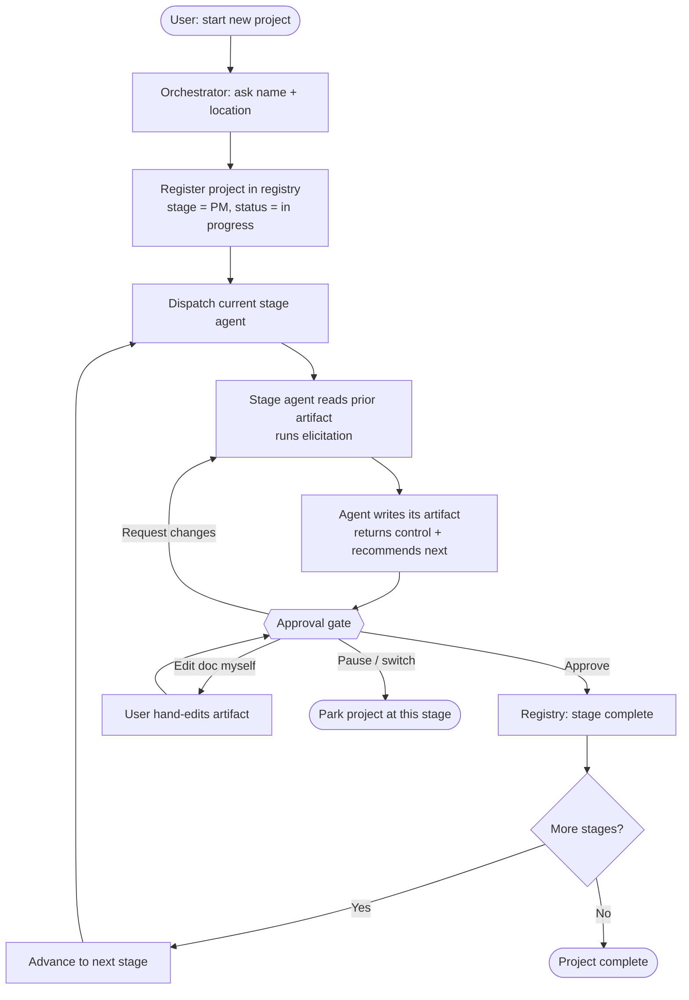

# Wireframe — Start-a-New-Project Flow (low-fi)

> The core Agent-C flow with the approval-gate loop. Workflow structure only.

**Notes**
- The gate is the only place the flow advances; agents never auto-chain.
- "Request changes" re-runs the same stage agent with feedback (revision loop).
- "Pause / switch" leaves the project parked; it's resumable from the registry.
